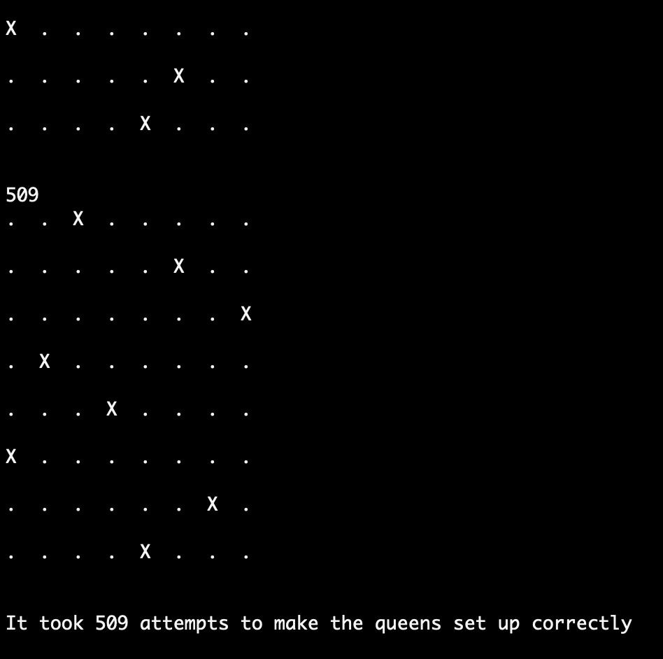
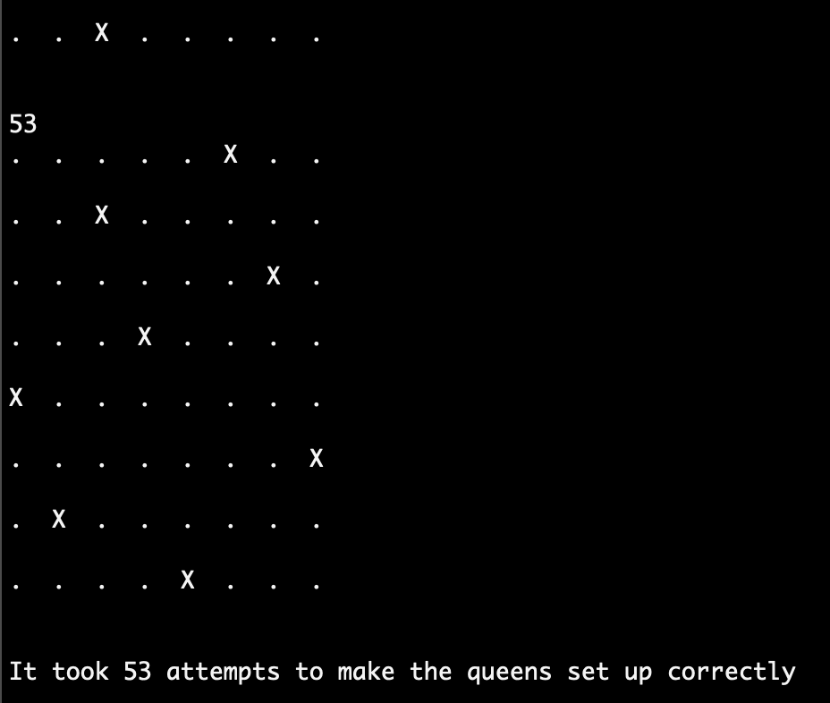

# Eight Queens problem

## Instructions
The goal is to place eight queens on a 8 x 8 chessboard so that no queen attacks any queen and no queen is attacked by any queen. It is solved in a brute force manner running until the solution is found. Each round is printed and a sum up is made once the solution is found.

Open the program in Visual Studio and click play.

## Screenshots

Below are two screenshots of two successful results

## Built with
The project is built in Visual Studio, as a .NET Console Project, with C# as programming language

## Author
* Albert Stjärne (https://github.com/AlbertStjarne)
